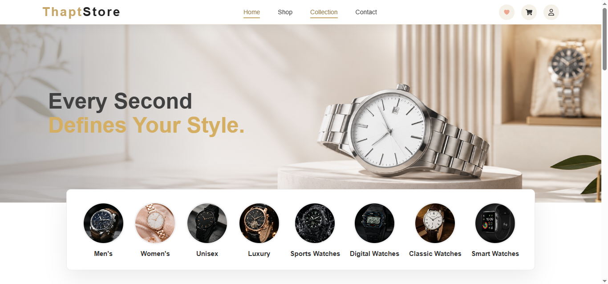
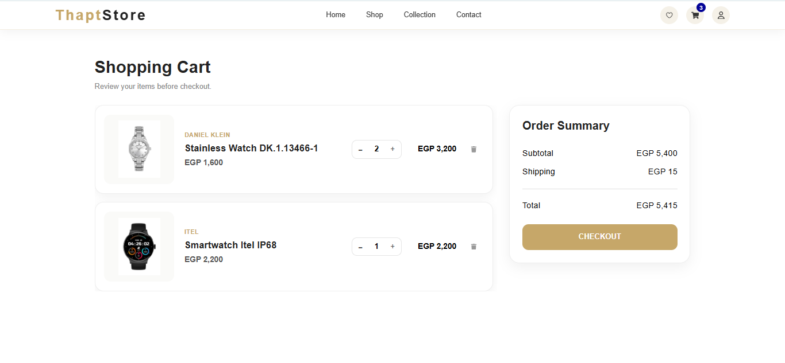
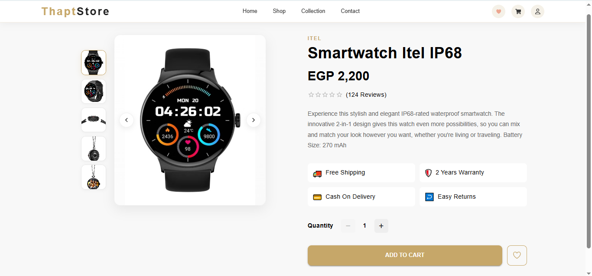
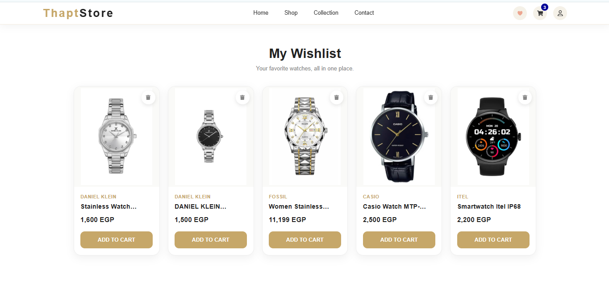
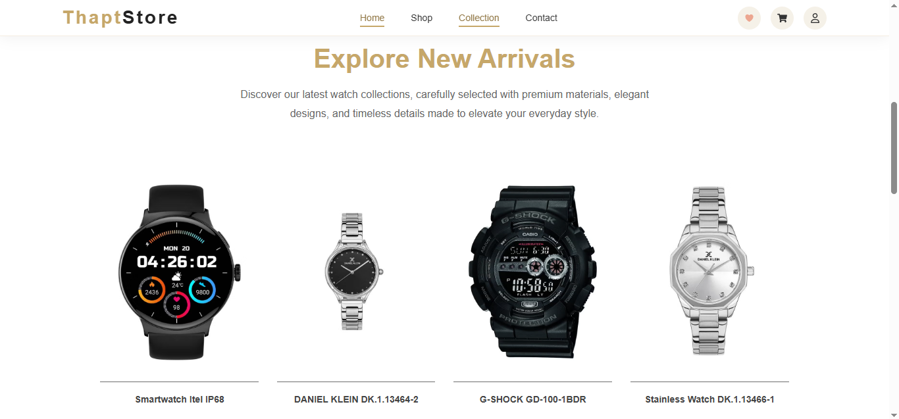
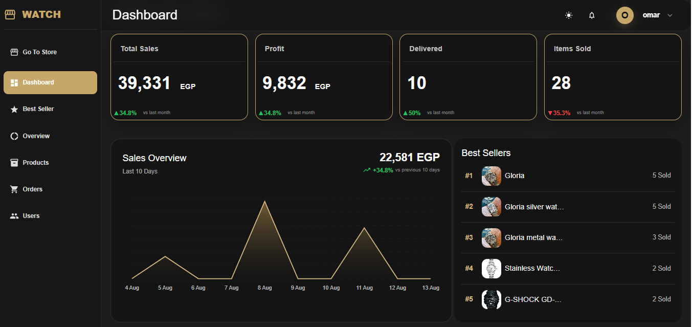
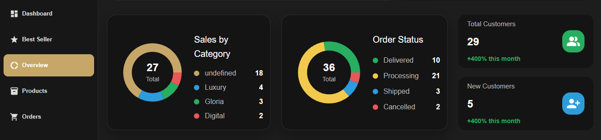
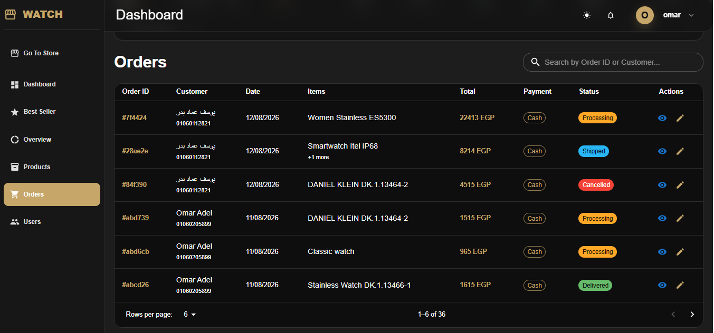
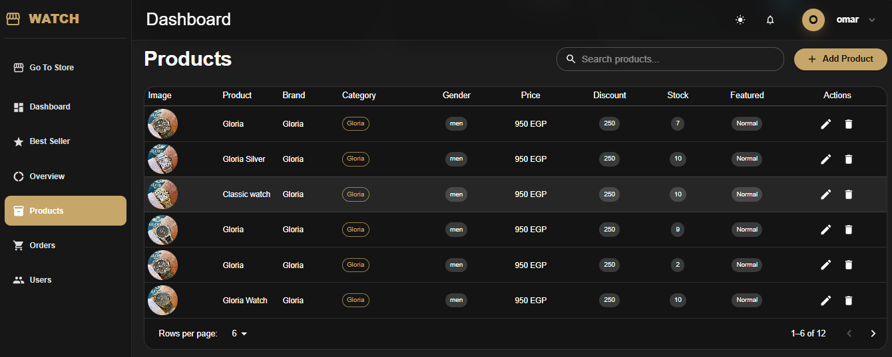

# Watch Store

A full-stack e-commerce web application for browsing, purchasing, and managing watches.

The project was built with a strong Frontend focus, supported by a custom RESTful backend API to provide a realistic full-stack e-commerce environment and practical experience integrating React applications with backend services.

## 🔗 Live Demo

[View Live Demo](https://watch-store-tau-eight.vercel.app/)

## 📂 GitHub Repository

[View Source Code](https://github.com/3Omar-Adel/watch-store)

## 🔐 Demo Credentials

### Admin Account

* Email: `omaradel@gmail.com`
* Password: `1234567`

Use these credentials to access the Admin Dashboard and explore product and order management features.

## 🚀 Project Overview

Watch Store is a responsive e-commerce platform that provides customers with a complete shopping experience, from browsing products to managing their cart, wishlist, addresses, and orders.

The project also includes a dedicated Admin Dashboard for managing products and orders and monitoring store activity.

## 📸 Screenshots

### Home Page



### Cart



### Product Details



### Wishlist



### New Arrivals



### Admin Dashboard



### Admin Overview



### Admin Orders



### Admin Products



## ✨ Features

### Customer Features

* User registration and login
* JWT-based authentication
* Browse and search products
* Product filtering and categorization
* Product details page
* Shopping cart
* Wishlist
* Product quantity management
* Checkout and order creation
* Address management
* Order history
* Responsive design for desktop and mobile
* Loading states and error handling

### Admin Features

* Protected admin dashboard
* Role-based access control
* Product management
* Add, update, and delete products
* Product image management
* Order management
* Update order status
* Sales statistics
* Dashboard overview
* Admin-specific navigation and layout

## 🛠️ Technologies

### Frontend

* React
* React Router
* Redux Toolkit
* React Context API
* Material UI
* Axios
* JavaScript (ES6+)
* CSS

### Backend

* Node.js
* Express.js
* MongoDB
* Mongoose
* JWT Authentication
* bcrypt
* REST API
* Cloudinary

## 🏗️ Project Structure

```text
watch-store/
│
├── client/
│   ├── src/
│   │   ├── admin/
│   │   ├── components/
│   │   ├── context/
│   │   ├── data/
│   │   ├── features/
│   │   ├── hooks/
│   │   ├── pages/
│   │   ├── routes/
│   │   ├── services/
│   │   └── theme/
│   │
│   └── package.json
│
├── server/
│   ├── config/
│   ├── controllers/
│   ├── middleware/
│   ├── models/
│   ├── routes/
│   ├── utils/
│   ├── server.js
│   └── package.json
│
├── .gitignore
├── README.md
└── structure.txt
```

## 🔐 Authentication

The application implements user authentication using JWT tokens.

Passwords are securely hashed using bcrypt before being stored, and protected routes are used for authenticated user and admin operations.

Role-Based Access Control (RBAC) is used to separate customer and admin permissions.

## 🔄 Frontend & Backend Integration

The React frontend communicates with the backend through RESTful APIs using Axios.

The backend was developed to provide practical experience with:

* API integration
* HTTP requests
* Authentication
* CRUD operations
* Database interaction
* Error handling
* Connecting frontend features with backend services

## ☁️ Image Management

Product images are uploaded and managed using Cloudinary.

This provides practical experience working with external cloud services and integrating image management into an e-commerce application.

## 📱 Responsive Design

The application is designed to provide a consistent experience across:

* Desktop
* Tablet
* Mobile devices

## 🎯 Project Goals

The main goal of this project was to build a realistic e-commerce application while strengthening practical Frontend development skills.

The project focuses heavily on:

* React architecture
* State management
* Component-based development
* API integration
* Authentication
* Responsive UI
* E-commerce workflows
* Admin dashboard development

## 🚀 Deployment

The application is deployed using Vercel.

The Frontend and Backend are deployed as separate services and communicate through RESTful APIs.

## 📌 Future Improvements

Possible future improvements include:

* Online payment integration
* Automated testing
* Advanced product search
* Performance optimization
* CI/CD pipeline with automated testing
* Additional analytics and reporting

## 👨‍💻 Author

**Omar Adel**
Frontend Developer
